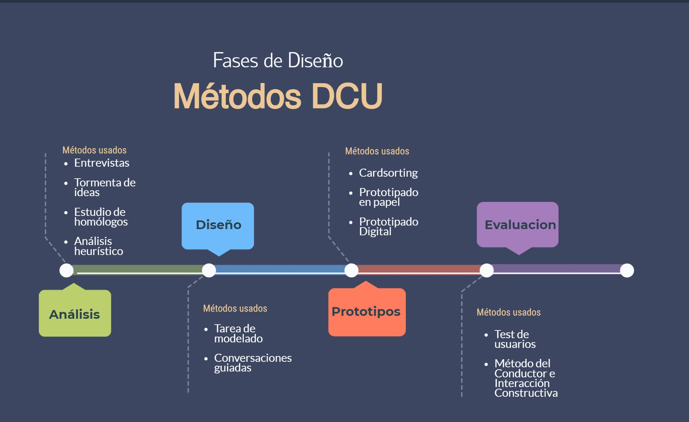
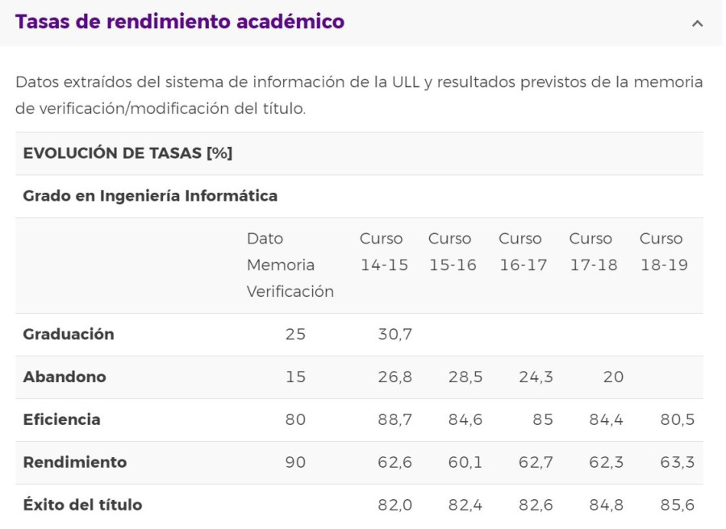
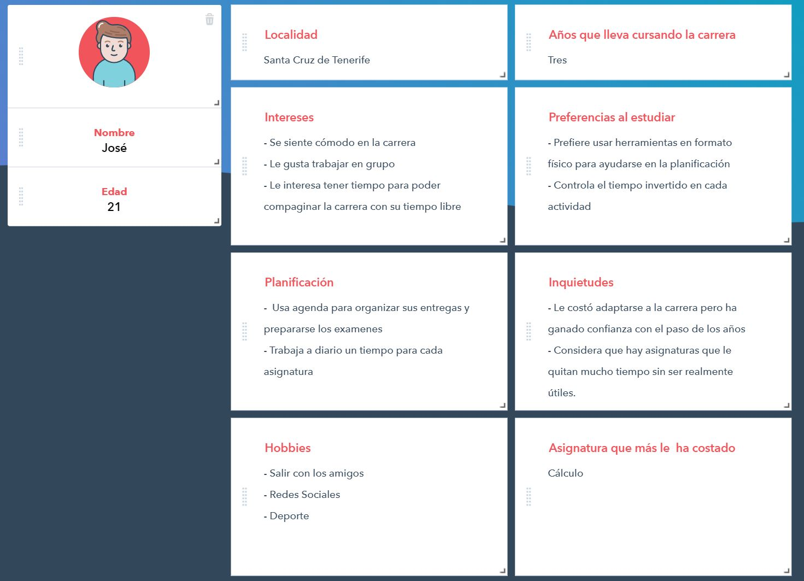

# Seminario DCU (Primera tarea)

### 1. Indicar en el documento del ejemplo de aplicación del DCU, qué actividades se corresponden con el diagrama de Métodos DCU y en qué fase del diseño se ubica.

### 2. Aplicar el DCU para la realización de un prototipo de una aplicación web para la gestión y optimización del tiempo de estudio de un estudiante del Grado en Ingeniería Informática de la ULL. Para ello:

* **Definir las tareas que se llevarán a cabo en la fase de investigación y diseño conceptual de la aplicación.**

  Las tareas que se llevarán a cabo en la fase de investigación son las siguientes:
    * Observaciones: Se realizará un análisis en profundidad de las actividades presentes en la universidad y el tiempo estimado que se debería utilizar para realizarlas.

      Como resultado de la observación, sacamos en claro que la tasa de abandono en la carrera ha disminuido con el paso del tiempo al igual que se ha incrementado el rendimiento y el éxito.

      

      En las directrices generales para diseñar nuevas titulaciones de grado aprobadas en 2008, se estipuló que, los créditos de las titulaciones, denominados ECTS, computan, además de las horas en el aula, el tiempo que se dedica al estudio y la elaboración de los trabajos de clase. En este sentido, cada crédito ECTS corresponde a 25 horas, repartidas en diez horas presenciales y quince de trabajo personal del alumno. Mediante las entrevistas comprobaremos si esas quince horas son realistas y si el alumnado trabaja más o menos horas de manera autónoma.

    
    * Entrevistas en grupo: Se preguntará al alumnado acerca del tiempo que realmente dedican a cada actividad, que tiempo consideran que sería el óptimo a dedicar, qué actividades les consumen tiempo que podrían dedicar a otras y otras cuestiones generales
    
      Preguntas a realizar en la entrevista:

      * ¿Has pensado en abandonar la carrera?, si es así ¿Es este un pensamiento recurrente?
      * ¿Consideras que dedicas 90 horas de trabajo autónomo en todo el cuatrimestre para cada asignatura, dedicas más, o dedicas menos?
      * ¿Qué asignatura ha sido la que más te ha costado?
      * ¿Qué curso hasta el momento te ha resultado más complicado?
      * ¿Creen que alguna asignatura les ha quitado tiempo de otras asignaturas que consideran más importantes?
      * ¿A qué asignatura le has dedicado más tiempo?
      * ¿Consideras que la carrera necesita de algún medio que te ayude a gestionar y optimizar el tiempo de estudio? Si es así, ¿Harías uso del mismo?
      * ¿Crees que esta carrera tiene una carga muy alta de trabajo?
      * ¿Crees que hay asignaturas de relleno?
      * ¿Crees que debería existir un medio por el que los profesores puedan gestionar y coordinar los trabajos mandados con otros profesores para administrar la carga de trabajo equitativamente?
      * ¿Con qué modalidad de las propuestas en los diferentes escenarios del COVID-19 crees que te permite una mejor optimización del tiempo?
        * Presencial
        * Semi-presencial
        * Online
      * Si tuvieras una aplicación que te ayudara a gestionar tu tiempo en los estudios y en tu vida, ¿Qué te gustaría que tuviera esa aplicación?

  
    * Encuentas: Se realizará una [encuesta online a partir de Google](https://docs.google.com/forms/d/e/1FAIpQLSf0_ej8SxjciekdSPXtzb2vHSsGb4TD5nFrziuJ9-lKXKW3aQ/viewform?usp=sf_link) a cada alumno para conocer sus hábitos concretos y poder obtener unos datos estadísticos significativos que nos permitan sacar conclusiones sobre cómo se organiza el alumnado, opiniones, propuestas de mejora...

  Y por otro lado, las tareas que se llevarán a cabo en la fase de diseño conceptual son las siguientes:
    * Identificar a los personajes: A través de las entrevistas y las encuestas, obtendremos datos y características que podemos generalizar para realizar un modelo de persona típico con características, inquietudes e intereses similares.
    
    * Identificar los perfiles de usuario: Agruparemos los distintos usuarios según situaciones generales que compartan como la situación demográfica, edad...  
  
    * Recopilar los requisitos: A partir de las entrevistas obtendremos el feedback de los posibles usuarios. Determinaremos qué requisitos piensan que debe tener la aplicación web y los tendremos en cuenta a la hora de diseñarla.
  
* **Definir en el documento los personajes y perfiles de usuario que vayan a usar tu producto y la especificación de requisitos.**  
Tras realizar las diversas entrevistas y encuestas a varios usuarios de la universidad hemos observado los resultados obtenidos sacando las siguientes conclusiones acerca de los personajes, usuarios y requisitos que debe disponer dicha aplicación web:
  * Personajes  
    
  * Perfiles de usuarios  
  

  * Especificación de requisitos:
    * Tener un calendario para gestionar lo que se anote.
    * Notificar y gestionar eventos próximos y descansos (Recordatorios)
    * Controlador de estado de tareas en tiempo real
    * Lista tareas u objetivos con fechas límites y una vez pasada la “fecha límite” esta sea eliminada de la lista
    * Ordenar lista de tareas u objetivos por fecha de entrega
    * Que sea accesible desde cualquier dispositivo
    * Si hay colapso entre trabajos o estudios, que la aplicación web avise ya que seguramente es un error.
    * Posibilidad de marcar tareas como
      * Realizada 
      * Entregada
      * A medias
      * Sin empezar
